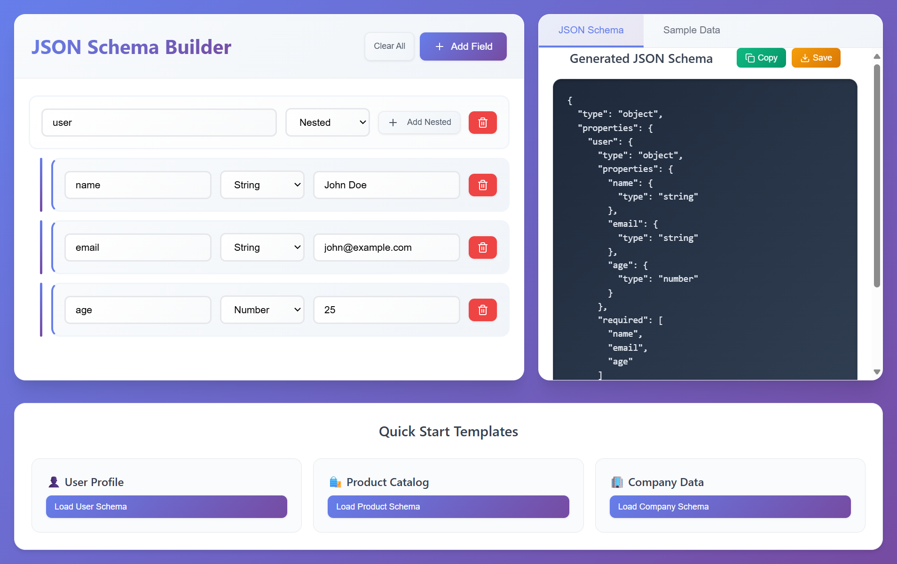

# JSON Schema Builder

> A beautiful, intuitive web app for building JSON schemas visually - no more wrestling with complex syntax!

Ever found yourself staring at a blank screen, trying to remember JSON schema syntax? Or spending hours debugging schema validation errors? **JSON Schema Builder** is here to save your sanity! 

This tool lets you build JSON schemas visually with a clean, modern interface. Click, type, and watch your schema come to life in real-time.

*👆 Beautiful interface showing schema building (left), generated JSON (right), and quick templates (bottom)*

## ✨ What Makes This Special?

- **🎨 Visual Schema Building** - No more JSON syntax headaches
- **🔄 Real-time Preview** - See your schema and sample data instantly  
- **📱 Responsive Design** - Works perfectly on any device
- **🎯 Quick Templates** - Get started with pre-built examples
- **💾 Export Options** - Copy to clipboard or download as files
- **🎭 Custom Values** - Add your own sample data for testing

## 🎯 Perfect For

- **Frontend Developers** building API interfaces
- **Backend Engineers** designing data validation
- **Product Managers** documenting data structures  
- **Students** learning about JSON schemas
- **Anyone** who works with JSON data!

## 🚀 Quick Start

### Option 1: Try It Online
Just visit the live demo and start building! No installation required.

### Option 2: Run Locally
```bash
# Clone the repo
git clone https://github.com/ayaz2004/HROne-frontend.git

# Install dependencies
npm install

# Start the dev server
npm run dev

# Open http://localhost:5173 in your browser
```

That's it! 🎉

## 🎮 How to Use

### 1. **Start Simple**
Click "Add Field" and create your first property. Give it a name and choose a type (string, number, or nested object).

### 2. **Add Some Data**
Fill in sample values to see how your data will look. The app generates realistic examples automatically!

### 3. **Go Nested** 
Building complex structures? Use the "Nested" type and click "Add Nested" to create child properties. You can nest as deep as you want!

### 4. **Quick Templates**
Feeling lazy? Try our pre-built templates:
- 👤 **User Profile** - Personal info with contact details
- 🛍️ **Product Catalog** - E-commerce product structure  
- 🏢 **Company Data** - Business information schema

### 5. **Export & Use**
Copy your schema to clipboard or download as a `.json` file. Ready to use in your projects!

## 🛠 Built With Love Using

- **React 19** - Latest and greatest
- **TypeScript** - Type safety FTW
- **Vite** - Lightning fast builds
- **Lucide Icons** - Beautiful, consistent icons
- **Modern CSS** - Clean, responsive design

## 🎨 Features Showcase

### 🔥 Complete Interface Overview

*The complete JSON Schema Builder showing all features in action*

### Real-time Schema Generation
Watch your JSON schema update instantly as you add fields. No delays, no waiting - just pure productivity.

### Nested Structures
Build complex, multi-level schemas with ease. Perfect for APIs that need nested objects and arrays.

### Clean, Modern UI
Designed with developers in mind. Clean interface that doesn't get in your way, with helpful visual cues and smooth interactions.

## � Key Features

| Feature | Description |
|---------|-------------|
| **Visual Schema Builder** | Drag, drop, and click to build schemas - no JSON syntax required |
| **Real-time Preview** | See your schema and sample data update instantly |
| **Custom Values** | Add your own sample data for realistic testing |
| **Quick Templates** | Start with pre-built User, Product, or Company schemas |
| **Export Options** | Copy to clipboard or download as JSON files |
| **Nested Support** | Build complex, multi-level data structures with ease |


*Happy schema building! 🎉*
